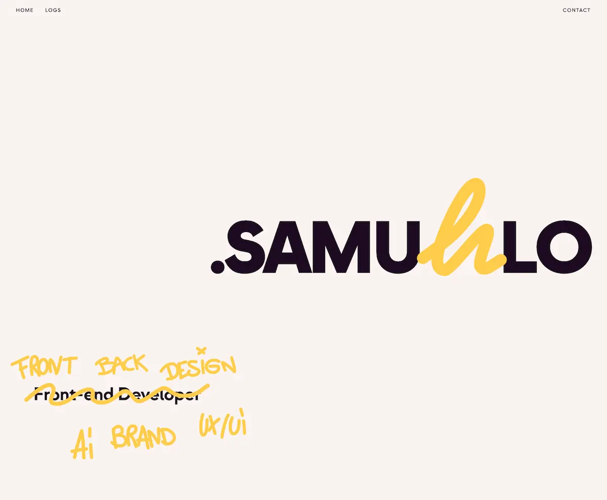

<div align="center">
  <br />
  <h1><code>./PORTFOLIO.sh</code></h1>

**Ecosistema interactivo trilingüe — GSAP, físicas reales, i18n completo y pipeline GitHub → AI → DB**
<br />

[](https://samuhlo.dev)
[](https://github.com/samuhlo/portfolio-app)

  <br />
  
  <br />
</div>

---

## // 00\_ THE_MISSION

Portfolio personal construido como un ejercicio de ingeniería de animación y automatización sobre Nuxt 4. El objetivo inicial era conseguir scroll-linked animations complejas (pinned sections, SVG draw-on-scroll, simulación de físicas 2D) manteniendo tres restricciones: SSR funcional, 60 FPS estables en móvil, y una arquitectura de composables que permita escalar sin acoplar lógica de animación a los componentes de vista.

Desde entonces ha crecido en tres ejes: un **pipeline de ingesta automatizada** (GitHub push → Octokit → DeepSeek → Zod → Neon) que auto-gestiona los proyectos del Playground, un **blog propio con Nuxt Content** con componentes personalizados y físicas en el header, y un **sistema i18n completo** con slugs traducidos por locale (ES/EN/GL), transiciones suaves coordiadas con GSAP y agentes de traducción locales para el flujo de escritura.

> _Toda la lógica de animación vive aislada en composables puros. Los componentes `.vue` solo declaran qué animar, nunca cómo. Si se elimina un módulo, el resto no se rompe._

---

## // 01\_ THE_BLUEPRINT

| LAYER       | TECH             | IMPLEMENTATION DETAIL                                                       |
| :---------- | :--------------- | :-------------------------------------------------------------------------- |
| **Core**    | `Nuxt 4`         | SSR con Vue Composition API pura. `srcDir: app/`                            |
| **Motion**  | `GSAP`           | Instanciado solo cliente + ScrollTrigger                                    |
| **Smooth**  | `Lenis`          | AutoRaf apagado, inyectado en el ticker de GSAP                             |
| **Physics** | `Matter.js`      | Canvas + IntersectionObs. con pause/resume                                  |
| **Styles**  | `Tailwind 4`     | Config v4 estricta, utility-first sin CSS roto                              |
| **i18n**    | `@nuxtjs/i18n`   | 3 locales (ES/EN/GL), slugs traducidos por locale, `translationKey` linking |
| **Content** | `Nuxt Content`   | Markdown → componentes Prose personalizados + schema con `translationKey`   |
| **Assets**  | `Cloudflare R2`  | Pipeline de upload para imágenes y vídeos del blog                          |
| **DB**      | `Drizzle + Neon` | PostgreSQL serverless, upsert vía webhook                                   |
| **AI**      | `DeepSeek`       | Extracción de metadatos desde READMEs de GitHub                             |
| **State**   | `Pinia`          | Store de proyectos con SWR cache (5 min TTL)                                |

---

## // 02\_ CONTROLLED_CHAOS

**Simulaciones de Gravedad Laziloaded**
La sección de contacto no es CSS. Es Canvas 2D renderizando coordenadas inyectadas por Matter.js, calculando los cuerpos midiendo los glyphs tipográficos en tiempo real. Inicia al 40% del viewport, se pausa automáticamente al salir y reanuda al volver — cero CPU fuera de pantalla. La misma arquitectura se reutiliza para el header del blog (`useBlogHeaderPhysics`) y la página de error (`useErrorPhysics`).

**Pipeline GitHub → AI → DB → Front**
Al hacer push a GitHub, un webhook dispara un pipeline completo: Octokit extrae el README, DeepSeek analiza y estructura los metadatos, Zod valida el resultado, y Drizzle hace upsert en Neon PostgreSQL. El front consume los datos via Pinia con caché SWR de 5 minutos. Modo strict elimina proyectos sin `mainImgUrl`, `imagesUrl` o `liveUrl`.

**Blog Trilingüe con Slugs Traducidos**
El blog usa Nuxt Content con tres idiomas (ES/EN/GL). Cada post tiene su propio slug por locale, vinculados mediante `translationKey`. El switcher de idioma resuelve la URL correcta via `useSetI18nParams` y `localePath`. Los posts unavailable hacen fallback al índice del blog del idioma destino. Agentes de traducción locales (EN/GL) integrados en OpenCode para el flujo de escritura de artículos.

**Transiciones de Idioma Sin Blink**
El cambio de idioma en el blog no es un parpadeo duro. Cada switcher ejecuta un fade-out previo a la navegación (`animateBeforeLocaleChange`), consume una señal one-shot (`useBlogNavigationContext`) en la página destino, y despliega una animación de entrada diferenciada: el índice mantiene categorías estáticas y solo anima la lista de posts; el post detail usa un timeline GSAP coordiado donde título y sidebar entran con opacidad pura y el contenido de lectura con micro-desplazamiento. `useBlogHeaderAnimationGate` bloquea el switch en `/blog` hasta que termina la animación de entrada del header.

**Scroll Animado Monolítico Unilateral**
Hero y Bio se descomponen con scrubbing de scroll reteniendo el avance (`completed[]`) para no deshacer la animación en scroll inverso. Los doodles SVG se dibujan via `dashOffset` orquestados desde `useDoodleDraw`, con `resetPaths`/`erasePaths` reutilizables para hover, scroll indicators y estados activos de categoría.

---

## // 03\_ CORE_LOGIC

El sistema de slugs traducidos. Cada post tiene un `translationKey` que lo vincula a sus versiones en otros idiomas. `useSetI18nParams` genera el mapeo correcto para cada locale, y los switchers lo consumen para resolver la URL exacta:

```typescript
// app/pages/blog/[slug].vue — Mapeo de slugs traducidos por locale
const { post, translations } = useBlogPost(slugValue);

watch(
  [post, translations],
  ([currentPost, currentTranslations]) => {
    if (!currentPost) return;

    // Slugs traducidos por locale para que switchLocalePath resuelva bien
    const params: Record<string, { slug: string }> = Object.fromEntries(
      currentTranslations.map((item) => [item.lang, { slug: item.slug }]),
    );

    if (!params[currentPost.lang]) {
      params[currentPost.lang] = { slug: currentPost.slug };
    }

    setI18nParams(params);
  },
  { immediate: true },
);
```

---

## // 04\_ ROADMAP

**001 — Blog Trilingüe** `[SHIPPED]`

Blog con Nuxt Content en tres idiomas (ES/EN/GL). Slugs traducidos por locale vinculados con `translationKey`. Componentes Prose custom (`ProsePre`, `ImageSlider`, `CodePreview`, `HandDrawn`, `DrawHeading`). Física cartoon en el header. Navegación prev/next por locale. Agentes de traducción locales para flujo de escritura EN/GL.

**002 — Pipeline de Proyectos (GitHub → AI → DB → Front)** `[SHIPPED]`

Ingesta automatizada vía webhook GitHub. README analizado por DeepSeek, validado con Zod y persistido en Neon PostgreSQL. Front consume via Pinia con caché SWR. Modo strict para control de calidad de datos.

**003 — Automatización del Blog (Doc → AI → DB → Web)**

Al subir un `.doc` con notas, un pipeline procesa el contenido con IA, extrae estructura, genera metadata SEO y persiste el resultado parseado en DB. La web lo expone como entrada de blog sin intervención manual.

**004 — Variantes de Diseño por Post**

Cada entrada de blog recibe variables de layout aleatorias o configurables (grid, tipografía, paleta, dirección de lectura) para romper la monotonía visual. Ningún post se ve igual a otro.

---

<div align="center">
<br />

<code>DESIGNED & CODED BY <a href='https://github.com/samuhlo'>samuhlo</a></code>

<small>Lugo, Galicia</small>

</div>

<!--
PORTFOLIO:METADATA
accent_color: #FFCA40
hover_text_card: dev portfolio

images_url:
https://raw.githubusercontent.com/samuhlo/portfolio-app/main/public/images/portada.webp

post_url:
blog_url:
-->
