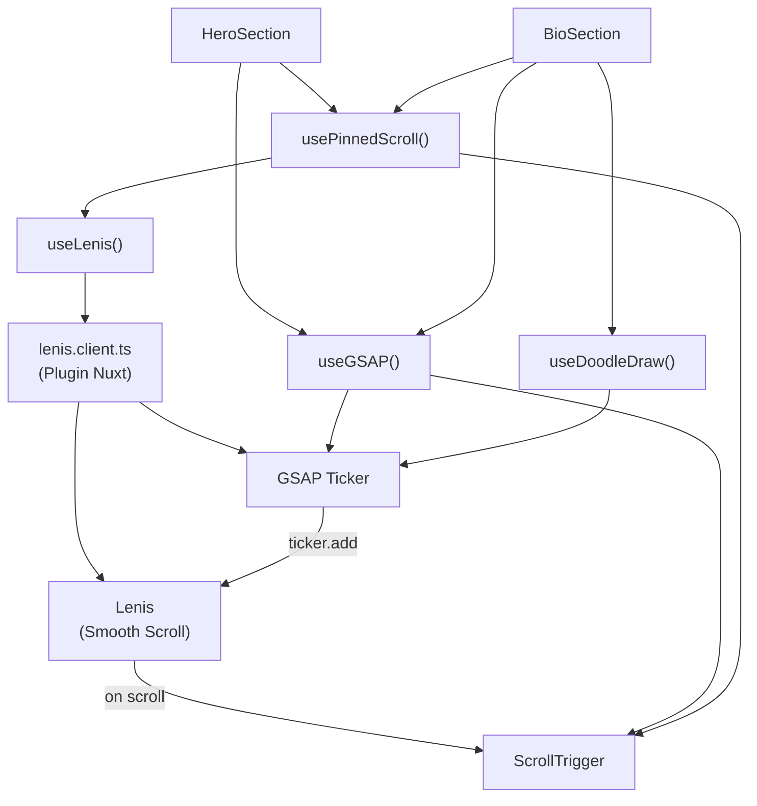

# Arquitectura del sistema de animaciones

> Cómo se conectan GSAP, Lenis y Vue para crear animaciones vinculadas al scroll en este portfolio.

---

## La analogía del teatro

Imagina un **teatro** donde el público controla la función con una manivela (el scroll):

| Concepto            | Analogía                                                                   |
| :------------------ | :------------------------------------------------------------------------- |
| **Lenis**           | El **mecanismo de la manivela** — hace que gire suave, sin tirones         |
| **ScrollTrigger**   | El **director de escena** — decide cuándo empieza y acaba cada acto        |
| **GSAP Timelines**  | Los **actores** — ejecutan la coreografía (animaciones)                    |
| **useGSAP**         | El **contrato de los actores** — garantiza que se van cuando acaba la obra |
| **usePinnedScroll** | El **telón que se congela** — la escena se queda fija mientras actúan      |
| **useDoodleDraw**   | El **maquillador** — prepara y dibuja los SVG a mano                       |

---

## Mapa de dependencias



---

## El flujo de un frame

Cada ~16ms (60fps), esto ocurre en orden:

```
1. GSAP ticker se dispara
   └─ 2. Llama a lenis.raf(time)
         └─ 3. Lenis interpola el scroll (suavizado)
               └─ 4. Lenis emite evento 'scroll'
                     └─ 5. ScrollTrigger.update() recalcula progreso
                           └─ 6. onUpdate() de cada trigger se dispara
                                 └─ 7. Los timelines avanzan según el progreso
```

> **Clave**: Lenis NO usa su propio `requestAnimationFrame`. Se engancha al ticker de GSAP (`autoRaf: false`) para que **todo vaya sincronizado en el mismo frame**. Si cada uno usara su propio rAF, habría desfase visual.

---

## La configuración de Lenis

```typescript
// plugins/lenis.client.ts

const lenis = new Lenis({
  autoRaf: false, // SIN rAF propio — lo controla GSAP
});

// Sincronizar ScrollTrigger con cada frame de Lenis
lenis.on('scroll', ScrollTrigger.update);

// Enganchar Lenis al ticker interno de GSAP
gsap.ticker.add((time) => {
  lenis.raf(time * 1000); // GSAP da el tiempo en segundos, Lenis lo espera en ms
});

// Desactivar el smoothing de lag de GSAP (Lenis ya suaviza)
gsap.ticker.lagSmoothing(0);
```

### ¿Por qué `lagSmoothing(0)`?

GSAP tiene un sistema interno que "comprime" el tiempo cuando detecta tirones (frames largos). Pero Lenis ya tiene su propia interpolación. Si ambos suavizan, se distorsionan mutuamente. `lagSmoothing(0)` le dice a GSAP: "no intervengas, Lenis se encarga".

---

## Estructura de archivos

```
app/
├── plugins/
│   └── lenis.client.ts      ← Inicializa Lenis + sincroniza con GSAP
├── composables/
│   ├── useGSAP.ts            ← Contexto GSAP con auto-cleanup
│   ├── useLenis.ts           ← Acceso a la instancia global de Lenis
│   ├── usePinnedScroll.ts    ← Secciones pineadas con fases de timeline
│   └── useDoodleDraw.ts      ← Animación de dibujo SVG stroke-dash
└── components/sections/
    ├── HeroSection.vue        ← Pin con 2 fases: título → subtítulo
    └── BioSection.vue         ← Texto independiente + pin solo para doodles
```

---

## Siguiente lectura

- [02 - Composables en detalle](./02-composables-detalle.md) — Cómo funciona cada composable
- [03 - Problemas resueltos](./03-problemas-resueltos.md) — Lecciones aprendidas y trampas
