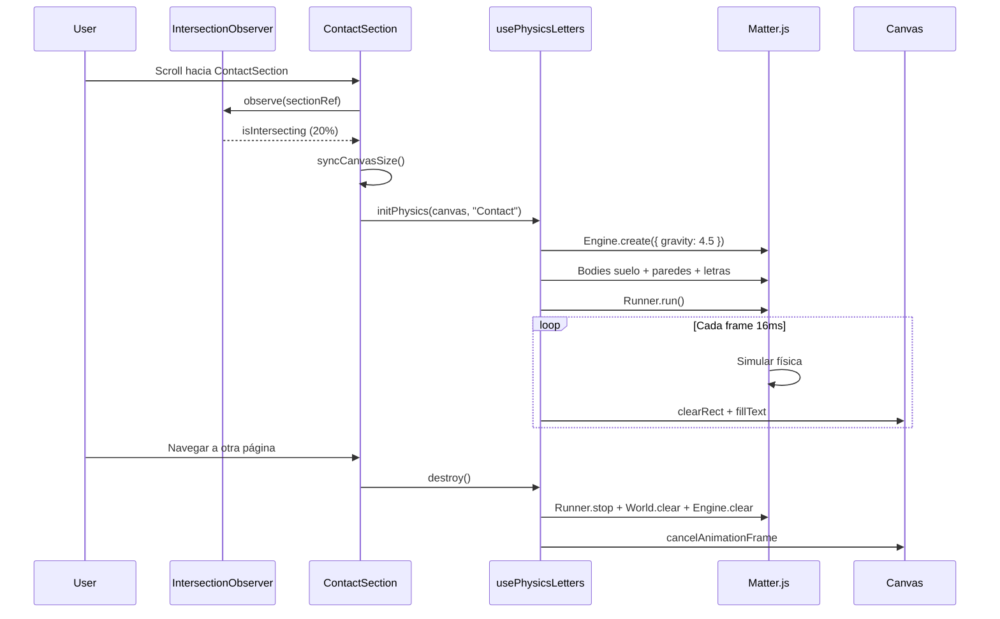
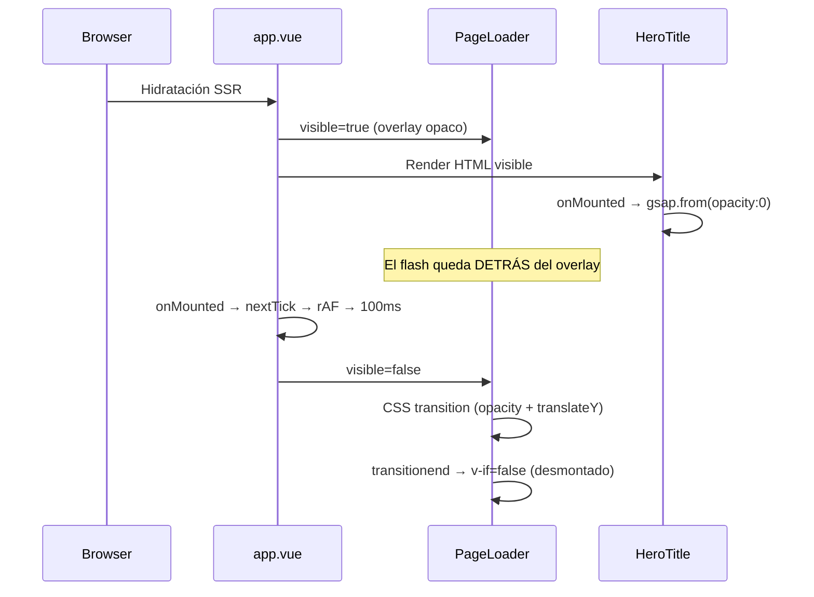

# Análisis Técnico de Componentes

> Documentación detallada sobre componentes complejos, por qué se construyeron de cierta manera y lecciones de rendimiento aplicadas.

---

## Índice de Componentes

| #   | Componente            | Descripción                                      | Técnica Principal                          |
| :-- | :-------------------- | :----------------------------------------------- | :----------------------------------------- |
| 1   | `NoiseBackground.vue` | Efecto TV Grain / Film Grain a pantalla completa | SVG dinámico en base64 + CSS Anim steps(2) |
| 2   | `ContactSection.vue`  | Letras que caen con física real (Matter.js)      | Canvas 2D + IntersectionObserver lazy init |
| 3   | `PageLoader.vue`      | Overlay anti-FOUC para hidratación de GSAP       | CSS-only + onMounted chain                 |

---

## 1. NoiseBackground.vue (Efecto TV Grain)

### El Retorno del Grano Analógico

El objetivo de este componente es simular el grano fotográfico o el "ruido estático" de una televisión antigua, para darle una textura orgánica al fondo liso del portfolio web.

Se buscaba que el componente fuera:

1. Dinámico: Ajustable mediante `props` (opacidad, densidad, tipo de mezcla).
2. De altísimo rendimiento: No interferir con animaciones complejas de GSAP ni penalizar batería.
3. Reactivo: Que se adaptase a los modos claros/oscuros.

### Iteraciones y Errores (Lo que NO hay que hacer)

Durante el desarrollo se probaron varias técnicas que resultaron ser problemáticas:

#### 1. Canvas 2D + `Math.random()` por pixel

- **Enfoque original:** Generar un patrón de píxeles mediante un bucle iterando sobre toda la resolución de pantalla usando `createImageData()`.
- **Por qué falló:** Calcular aleatoriedad matemática a 60 FPS o más es un antipatrón en la web. Consumía un ciclo inmenso de CPU y estrangulaba el hilo principal de Node, haciendo que Lenis y GSAP perdieran el frame.

#### 2. SVG + `transform: translate3d()` rápido + CSS `mix-blend-mode`

- **Enfoque inicial renderizado:** Aplicar el componente renderizando un nodo `<svg>` en el DOM o inyectado como background. Activar la GPU mediante `transform: translateZ(0)` para moverlo rápido de posición.
- **Por qué falló:** Bug conocido de navegadores Webkit (Chrome/Safari). Las propiedades de composición visual de CSS (`mix-blend-mode` tipo `soft-light`, `multiply`, `overlay`) se rompen cuando el elemento vive en una capa separada forzada por la aceleración 3D del hardware. Resultado: La mezcla con el fondo no funcionaba y se volvía invisible.

### La Solución Definitiva (Técnica "AliTwoTimes")

Inspirado en webs referentes, la solución final descartó el esfuerzo en CPU en favor del "Tiling CSS" puro usando una textura estática generada en el aire.

#### El Código Core

```vue
<!-- Extracto de la estructura del componente actual -->
<template>
  <div class="noise-overlay" aria-hidden="true" />
</template>

<script setup>
// Generamos el patrón usando un SVG Turbulento dinámico
const noiseUrl = computed(() => {
  const svg = `<svg xmlns='http://www.w3.org/2000/svg' width='200' height='200'>
    <filter id='n'>
      <feTurbulence type='fractalNoise' baseFrequency='${props.baseFrequency}' numOctaves='4' stitchTiles='stitch'/>
    </filter>
    <rect width='200' height='200' filter='url(#n)' opacity='1'/>
  </svg>`;

  return `url("data:image/svg+xml;base64,${btoa(svg)}")`;
});
</script>

<style scoped>
.noise-overlay {
  /* Truco 1: Más grande que la pantalla */
  top: -10rem;
  left: -10rem;
  width: calc(100% + 20rem);
  height: calc(100% + 20rem);

  /* Truco 2: Tiling infinito de la textura base64 */
  background-image: v-bind(noiseUrl);
  background-repeat: repeat;

  /* Truco 3: Animación de "salto" discreto (No suavisado) */
  animation: grain v-bind('`${props.speed}s`') steps(2) infinite;
}

@keyframes grain {
  0% {
    transform: translate3d(0, 9rem, 0);
  }
  /* ... saltos aleatorios sin transición de la GPU ... */
  100% {
    transform: translate3d(-7rem, 0, 0);
  }
}
</style>
```

### Lecciones Aprendidas del NoiseBackground

1. **Usa hardware para animar, no matemáticas en bucle:**
   Generar gráficas en tiempo real es costoso. La mejor forma de simular el ruido no es calcularlo cada frame, sino calcular una "baldosa" o textura de ruido pequeña una sola vez (mediante SVG o cargando una imagen) y hacerle `repeat`.
2. **Efecto de salto con `steps()`:**
   Si quieres simular la brusquedad analógica, evita la interpolación suave. Al usar `<animación> steps(2)` conseguimos que la GPU mueva la textura bruscamente, dando un aspecto estroboscópico propio del grano de película.
3. **El límite del viewport:**
   Para animar libremente saltos de un fondo hacia un lado y otro simulando la aleatoriedad, el propio contenedor de la malla debió ser `calc(100% + Xrem)` para evitar que al moverse exponga un lado de la página donde termina la malla.
4. **Mix-Blend-Mode es delicado:**
   Evita aplicar variables reactivas como `transition: all` a elementos usando máscaras de fusión, su comportamiento multi-capa cambia agresivamente por navegador.

---

## 2. ContactSection.vue (Letras con física)

### Qué hace

La sección de contacto muestra la palabra "CONTACT" como letras que caen con gravedad real (Matter.js). La simulación solo se activa cuando la sección entra en el viewport, para no consumir recursos desde el inicio.

### El patrón: Lazy Init con IntersectionObserver

La física no se activa al montar el componente, sino al **verlo**. Esto es crucial porque Matter.js consume CPU (bucle de simulación + render loop de Canvas):

```typescript
let observer: IntersectionObserver | null = null;
let triggered = false;

const handleIntersection: IntersectionObserverCallback = (entries) => {
  for (const entry of entries) {
    if (entry.isIntersecting && !triggered && canvasRef.value) {
      triggered = true; // Solo una vez
      syncCanvasSize(); // Ajustar canvas al contenedor
      initPhysics(canvasRef.value, TEXT, {
        isMobile: canvasRef.value.width < 768,
      });
    }
  }
};

onMounted(() => {
  syncCanvasSize();
  observer = new IntersectionObserver(handleIntersection, {
    threshold: 0.2, // Se activa cuando el 20% de la sección es visible
  });
  if (sectionRef.value) observer.observe(sectionRef.value);
});
```

**¿Por qué `threshold: 0.2`?** Si usáramos `0` (default), la simulación arrancaría antes de que el usuario viera la sección. Con `0.2`, las letras empiezan a caer justo cuando la sección aparece lo suficiente en pantalla como para que el usuario lo note.

**¿Por qué `triggered = false`?** Sin este flag, al scrollear arriba y abajo, la simulación se reiniciaría cada vez que la sección reapareciera en el viewport.

### Sincronización Canvas ↔ Section

```typescript
const syncCanvasSize = (): void => {
  canvas.width = section.clientWidth;
  canvas.height = section.clientHeight;
};
```

El Canvas de HTML tiene **dos tamaños**: el CSS (cómo se ve) y el interno (cuántos píxeles dibuja). `syncCanvasSize` los sincroniza para que las letras de Matter.js caigan en las coordenadas correctas. Si no hiciéramos esto, las letras se verían estiradas o aplastadas.

### Ciclo de vida completo



### Por qué NO usa useGSAP

`ContactSection` es el único componente de animación que **no** usa `useGSAP`. La razón:

- `useGSAP` envuelve `gsap.context()` para auto-limpieza de tweens/ScrollTriggers de GSAP
- Las letras de contacto usan **Matter.js** (motor de física) + **Canvas 2D** (render) — ninguna API de GSAP
- La limpieza es manual: `cancelAnimationFrame` + `Runner.stop` + `Engine.clear`
- Se gestiona con `onUnmounted(() => destroy())` directamente

> **Lección**: No fuerces un patrón de abstracción donde no encaja. `useGSAP` existe para GSAP. Matter.js tiene su propio ciclo de vida y merece su propia limpieza.

---

## 3. PageLoader.vue (Overlay anti-FOUC)

### El problema: Flash Of Unstyled Content en el Hero

`HeroTitle.vue` usa `gsap.from()` para animar la entrada del título. Esto significa que el texto se renderiza **visible** en el DOM y luego GSAP lo fuerza a `opacity: 0` para animarlo de vuelta. El resultado en la primera carga:

1. El HTML se pinta con las letras visibles
2. GSAP se inicializa en `onMounted` y setea `opacity: 0`
3. GSAP anima `opacity: 0 → 1`

El usuario ve: **letras → parpadeo → letras animándose**. Es un artefacto clásico de `gsap.from()` en SSR/hidratación.

### La solución: Overlay opaco hasta que GSAP esté listo

Un `<div>` fullscreen con el mismo color de fondo (`--color-background`) que tapa todo hasta que los `onMounted` de los hijos terminan de ejecutar GSAP.

**Decisión clave: CSS puro, sin GSAP.** El loader debe funcionar _antes_ de que GSAP cargue. Si dependiera de GSAP para su propia animación, tendríamos el mismo problema de chicken-and-egg.

### Cadena de sincronización en `app.vue`

```typescript
const isLoading = ref(true);
const TRANSITION_BUFFER_MS = 100;

onMounted(async () => {
  await nextTick(); // DOM de los hijos actualizado
  requestAnimationFrame(() => {
    // Browser ya pintó el frame
    setTimeout(() => {
      // Buffer mínimo para suavizar
      isLoading.value = false; // Trigger fade-out del overlay
    }, TRANSITION_BUFFER_MS);
  });
});
```

**¿Por qué tres niveles?**

| Paso                    | Garantiza                                                        |
| :---------------------- | :--------------------------------------------------------------- |
| `onMounted` (app.vue)   | Los `onMounted` de los hijos ya ejecutaron (Vue monta bottom-up) |
| `nextTick`              | El DOM refleja los cambios que GSAP hizo en los hijos            |
| `requestAnimationFrame` | El browser ya pintó el frame con el estado correcto              |
| `setTimeout(100)`       | Buffer visual para que la transición de fade-out no sea abrupta  |

### Ciclo de vida del overlay



### Anatomía del fade-out

El overlay no desaparece con `v-if` directo (sería un corte brusco). Usa un patrón de **dos fases**:

1. `visible` pasa a `false` → activa clase `loader-leaving` (CSS transition: opacity + translateY)
2. Al terminar la transición (`@transitionend`) → `shouldRender = false` → `v-if` lo desmonta del DOM

Esto asegura que la transición de salida se complete visualmente antes de limpiar el nodo.

> **Lección**: `gsap.from()` es peligroso en SSR porque el estado inicial del DOM es visible. Si no puedes cambiar a `gsap.fromTo()`, un overlay de carga es la solución más limpia sin tocar la lógica de animación existente.
